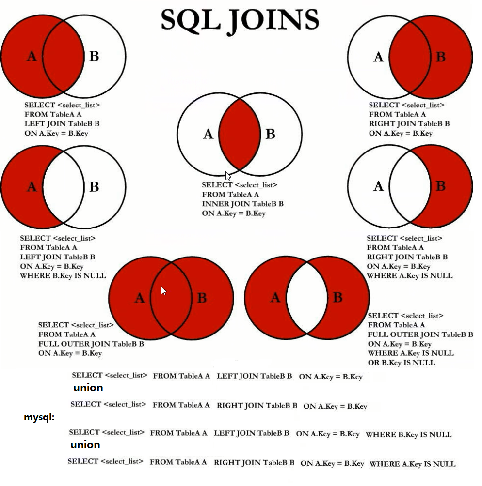
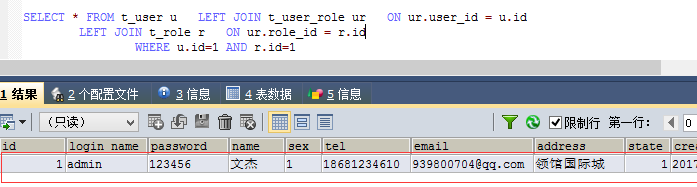
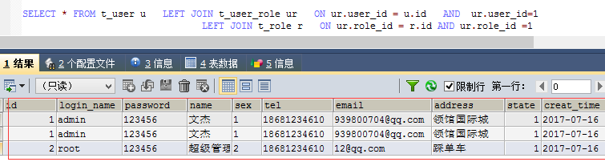
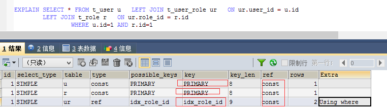
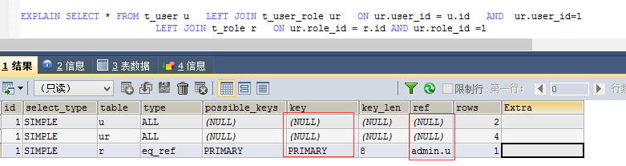

# SQL JOIN的7种方式
----------------

### JOIN在查询时用的非常频繁

1. 常用join方式 

### left JOIN的的后面能不能带条件

1. 从结果的情况来看

> SELECT * FROM t_user u LEFT JOIN t_user_role ur ON ur.user_id = u.id
> LEFT JOIN t_role r ON ur.role_id = r.id
> WHERE u.id=1 AND r.id=1

		

	>	SELECT * FROM t_user u   LEFT JOIN t_user_role ur   ON ur.user_id = u.id
		   AND  ur.user_id=1 LEFT JOIN t_role r   ON ur.role_id = r.id
				 AND ur.role_id =1

	

2. 从使用索引的情况来看

> EXPLAIN SELECT * FROM t_user u LEFT JOIN t_user_role ur ON ur.user_id = u.id
> LEFT JOIN t_role r ON ur.role_id = r.id
> WHERE u.id=1 AND r.id=1

		

	>	EXPLAIN SELECT * FROM t_user u   LEFT JOIN t_user_role ur   
	 		ON ur.user_id = u.id   AND  ur.user_id=1
				LEFT JOIN t_role r   ON ur.role_id = r.id AND ur.role_id =1

	

3. 结论：

> left join on 后面跟 and 带过滤条件并不能起到过滤作用。而且导致不能使用索引。

