## 单值索引和复合索引的区别

1. 首先来看没有索引的情况：可以看出 type 为 all 是全表扫描性能不高，优化就是建立索引。

> EXPLAIN SELECT address,name FROM t_user u WHERE u.address='成都' AND u.name='haha'

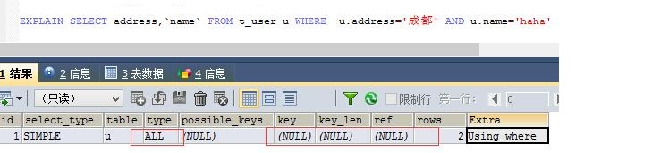

----------

2. 来看创建两个单值索引的情况：看到possible_keys为 idx_a,idx_n 但是key为idx_a说明只用了一个索引另一个索引没有使用（mysql会自动使用最优的索引）

> CREATE INDEX idx_a ON t_user(address);
> CREATE INDEX idx_n ON t_user(name);
> EXPLAIN SELECT address,name FROM t_user u WHERE u.address='成都' AND u.name='haha'

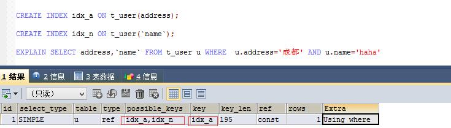

----------

3. 来看创建一个复合索引的情况：key为idx_a_n说明用了索引,ref为 const,const 说名这个复合索引对这两个字段都起作用。Extra中有Using index（覆盖索引）sql性能很好。

> CREATE INDEX idx_a_n ON t_user(address,name);
> EXPLAIN SELECT address,name FROM t_user u WHERE u.address='成都' AND u.name='haha'

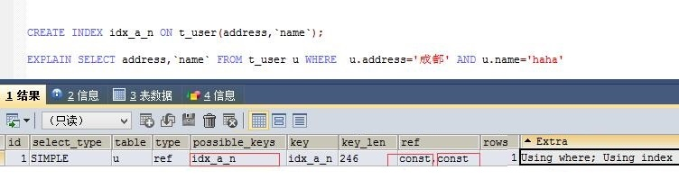

----------

## join连接索引优化

1. left join使用索引，索引应建立在右边。

> 分析“FROM t_user u LEFT JOIN t_user_role ur ON u.id=ur.user_id LEFT JOIN t_role r ON ur.role_id =r.id”索引该如何建立.
> 1、“t_user u LEFT JOIN t_user_role” 所以“u.id=ur.user_id”中user_id应建索引
> 2、“LEFT JOIN t_role”所以“ur.role_id =r.id”中id应建索引。因为id为主键所以本身就是主键索引。

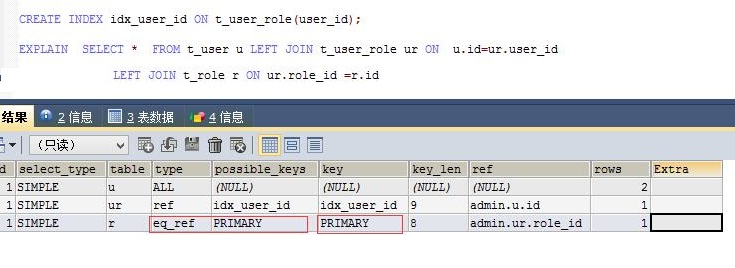

----------

2. RIGHT join使用索引，索引应建立在左边。

> 同理分析“FROM t_user u RIGHT JOIN t_user_role ur ON u.id=ur.user_id RIGHT JOIN t_role r ON ur.role_id =r.id”索引该如何建立.
> 1、“RIGHT JOIN t_user_role ur” 所以“ u.id=ur.user_id”中id应建索引，因为id为主键所以本身就是主键索引。
> 2、“RIGHT JOIN t_role r”所以“ur.role_id =r.id”中role_id应建索引。

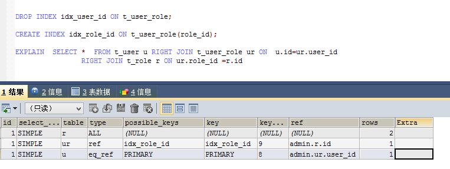

----------

## 索引失效

**`索引失效的大致情况如下`**
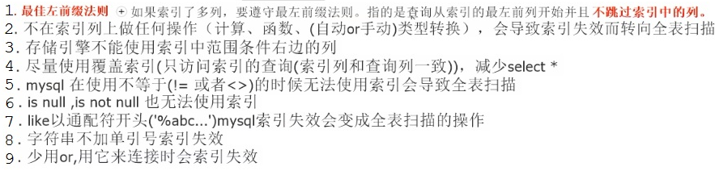
1、如index(a,b,c)=> where b=5 and c=6 b,c不会使用索引.因为缺少a。
3、如index(a,b,c)=> where a=1 and b>5 and c=6 那么a,b会用到索引，c不会使用索引. b是范围后面的都会中断。
7、可以使用覆盖索引的方式解决：like'%..%'索引失效。
9、可以使用 union 带替代 or

----------

## index列子分析

index(c1,c2,c3,c4) : order by
> where c1>50 order by c2 出现:filesort。
> where 1=1 order by c1 asc,c2 desc 出现:filesort。
> where 1=1 order by c1 asc,c2 desc 出现:filesort。
> where c1="c1" and c5='c5' order by c3,c2 出现:filesort。
> where c1="c1" and c5='c5' order by c2,c3 不出现:filesort。
> where c1="c1" and c5='c5' and c2='c2' order by c3,c2 不出现:filesort。

index(c1,c2,c3,c4):group by
> where c1="c1" and c4='c4' group by c2,c3 不出现:filesort、temp
> where c1="c1" and c4='c4' group by c3,c2 出现:filesort、temp。
> where c1="c1" and c4='c4' and c2='c2' group by c2,c3 不出现:filesort、temp。

group by:分组之前基本需要排序，可能会有临时表产生很耗性能。

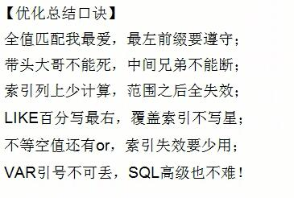

----------

## 小表驱动大表

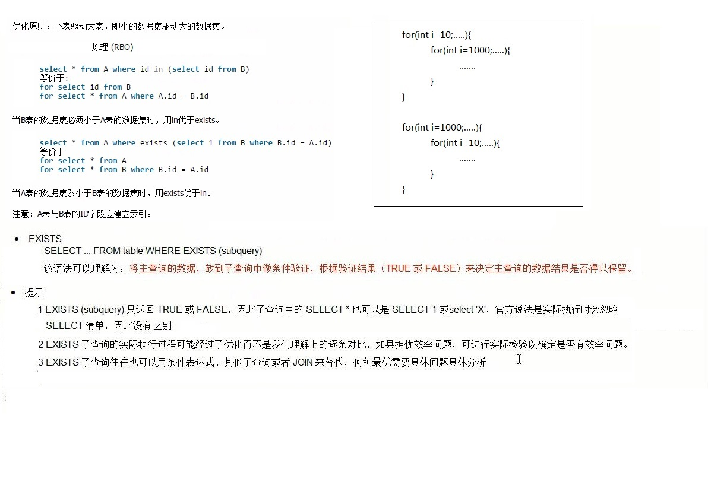

	exists不一定性能比in高，exists是in的一个变种替代。

----------

## 慢查询开启及分析

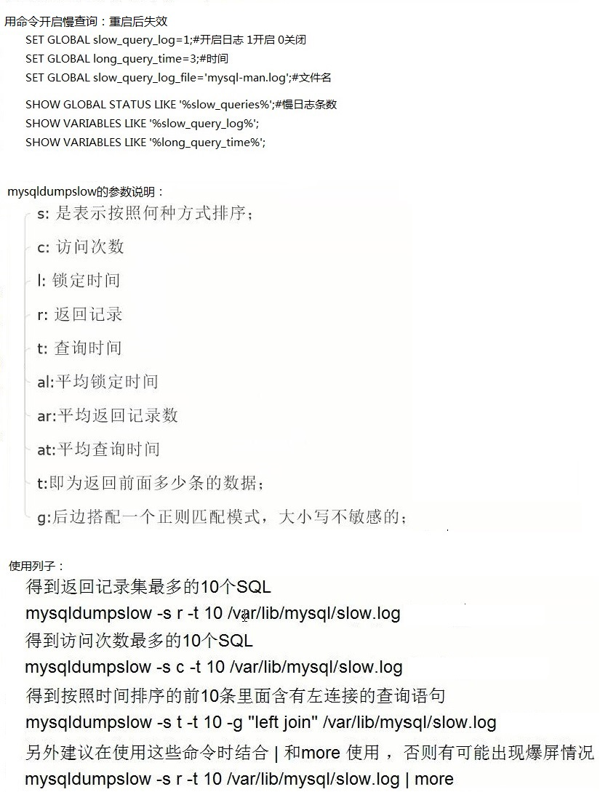

## profile

> SHOW VARIABLES LIKE'profiling';
> SET profiling=ON;
> SHOW PROFILES;
> SHOW PROFILE cpu,block io FOR QUERY Query_ID;或将 cpu,block io 改为 all

若：Status中出现以下4个中一个必须优化。

----------

## 全局查询日志

> SET GLOBAL general_log=1;#0为关闭 1为开启
> SET GLOBAL log_output='Table';

执行：SELECT * FROM mysql.general_log; 将看到执行过的sql信息。 
sql优化过程步骤：
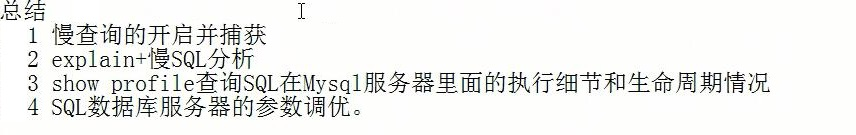

## Mysql的锁

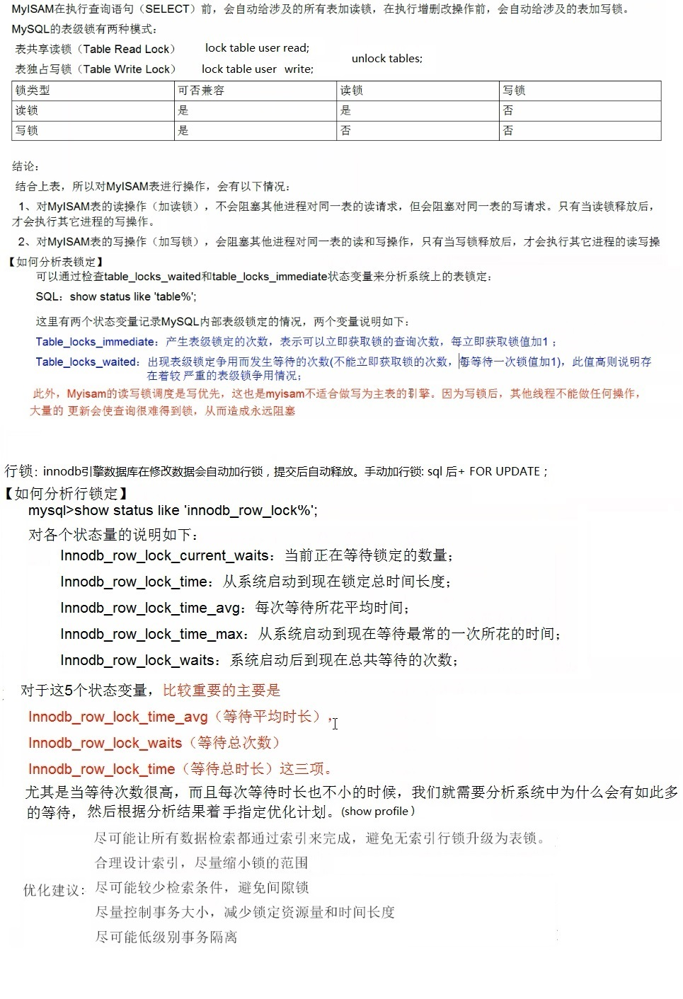