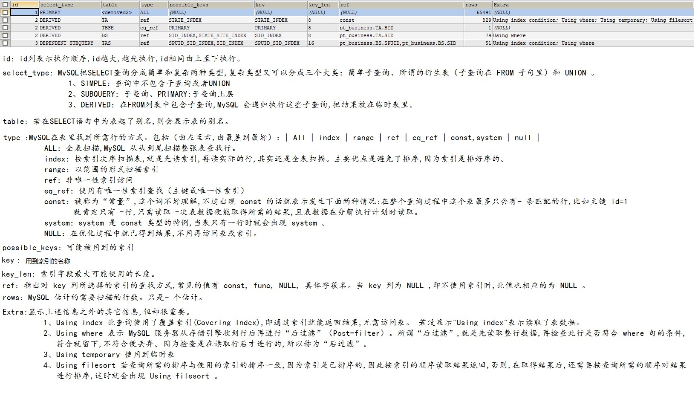

 
## mysql视图

- 视图: 视图是一个虚拟表，其内容由查询定义。同真实的表一样，视图包含一系列带有名称的列和行数据。但是，视图并不在数据库中以存储的数据值集形式存在。行和列数据来自由定义视图的查询所引用的表，并且在引用视图时动态生成。

**`为什么使用视图`**
> 1、重用sql语句。
> 2、简化复杂的sql操作。在编写查询后，可以很方便的重用他，而不必知道他的基本查询细节。
> 3、使用表的组成部分而不是整个表。
> 4、保护数据。可以给用户授予表的特定部分的访问权限。
> 5、更改数据的格式和表示。视图可返回与底层表的表示与格式不同的数据。

**`规则和限制`**
> 1、与表一样视图必须唯一命名。（不能给视图取和别的视图或者是表相同的名字）
> 2、对于可以创建的视图个数是没有限制的。
> 3、为了创建视图，必须有足够的权限，这些权限是有数据库管理员授予的。
> 4、视图可以嵌套，即可以利用从其他视图中检索数据的查询来构建一视图。
> 5、ORDER BY可以使用在视图上，但是如果从该视图中检索数据的SELECT中如果也包含ORDER BY 语句，则视图中的ORDER 将会被覆盖。
> 6、视图不能有索引，也不能有关联的触发器或默认值。
> 7、视图可以和表一起使用。例如，编写一条连接视图与表的SELECT语句。
> 8、视图是不允许数据修改的（除了只从一个实表抽出若干列，而且没统计列和groupby，相关没涉及列修改符合表约束，这种视图部分DBMS允许修改）。

**`视图的创建`**
> CREATE VIEW view_name AS(
> SELECT column_name(s)
> FROM table_name
> WHERE condition
)

**`使用视图`**
> 1、使用CREATE VIEW来创建视图
> 2、使用SHOW CREATE VIEW viewname，来查看创建视图的语句。
> 3、使用DROP VIEW viewname来删除视图。
> 4、更新视图的时候可以先用DROP 在用CREATE，也可以直接使用CREATE OR REPLACE VIEW
> 。如果要更新的视图不存在，第二种更新的语句将会创建一个视图。如果更新的视图存在，则在第二条更新语句使用后将会替换以前的视图。

**`分析视图`**

1. 首先创建视图：
2. 执行: EXPLAIN SELECT * FROM ur WHERE ur.uname='文杰'
3. 结果: 看结果发现： ur.uname='文杰' 使用了全表扫描。
   

3. 在真实表数据上创建索引视图能否使用呢：CREATE INDEX idx_name ON t_user (`name`);
   看结果发现： ur.uname='文杰' 使用了索引。 
   总结：查询视图的性能与组成视图的sql直接相关。当你查询视图的时候，数据库会先执行生成视图的语句，再在视图的基础上进行查询。
   若视图数据列的来源列上建了索引（ur.uname和t_user.name的关系），那么视图也会使用索引。
   

----------

## mysql执行计划分析：

