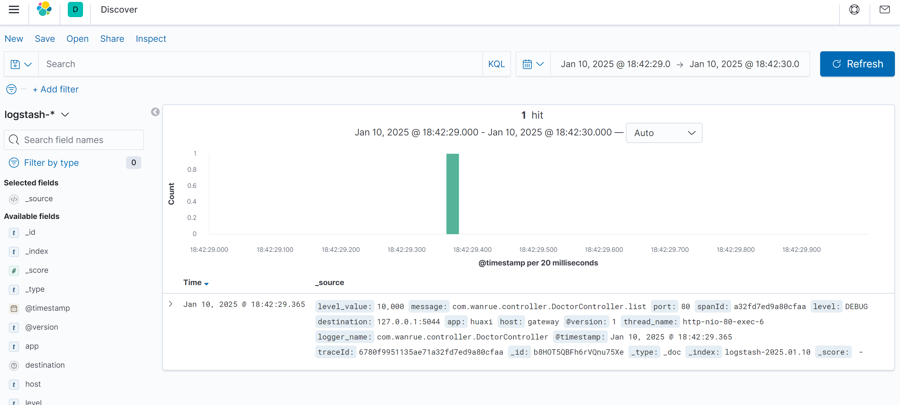

## ELK日志监控平台的基本概念和组成

**`1.什么是ELK日志监控平台`**

1. ELK日志监控平台是一个开源的实时日志分析平台，主要由Elasticsearch、Logstash和Kibana三个组件组成。
2. Elasticsearch（ES）‌：一个分布式的Restful风格的搜索和数据分析引擎，支持全文搜索、结构化搜索以及分析，并且具有速度快、可扩展性强、弹性好、灵活度高等特点。
3. Logstash‌：一个开源数据收集引擎，具有实时管道功能，能够动态地将来自不同数据源的数据统一起来，并将数据标准化到所选择的目的地。Logstash收集数据的过程主要分为输入、过滤器和输出三个部分。
4. Kibana‌：一个基于浏览器的界面，用于快速创建和分享动态数据仪表板，以追踪Elasticsearch的实时数据变化。Kibana可以使海量数据通俗易懂，并且搭建过程简单。
   **`2.ELK日志监控平台的工作原理和流程`**
1. ELK平台的工作流程大致如下：
2. ‌日志采集‌：Logstash作为Shipper角色，部署在产生日志的服务上，负责采集服务产生的日志文件，并将消息推送到消息队列（如Redis）。
3. ‌日志处理‌：另一台服务器上部署的Logstash作为Indexer角色，从消息队列中读取数据，经过Filter的解析和处理后，输出到Elasticsearch集群中存储。
4. ‌日志存储‌：Elasticsearch主副节点之间数据同步，确保日志数据的可靠性和完整性。
5. ‌日志分析‌：Kibana读取Elasticsearch中的日志数据，并在Web页面上展示，用户可以通过Kibana进行日志搜索、分析和可视化操作。

## ELK服务端安装

**`docker compose安装ELK`**

```yaml
version: "3.0"
services:
  elasticsearch:
    image: elasticsearch:7.8.0
    container_name: elasticsearch
    environment:
      - cluster.name=esCluster
      - discovery.type=single-node
      - "ES_JAVA_OPTS=-Xms512m -Xmx512m"
    networks:
      - local
    ports:
      - "9200:9200"
      - "9300:9300"

  kibana:
    image: kibana:7.8.0
    container_name: kibana
    environment:
      - SERVER_NAME=kibana
      - ELASTICSEARCH_HOSTS=http://elasticsearch:9200
    networks:
      - local
    ports:
      - "5601:5601"
    depends_on:
      - elasticsearch

  logstash:
    image: logstash:7.8.0
    container_name: logstash
    environment:
      - "LS_JAVA_OPTS=-Xms256m -Xmx256m"
    volumes:
      - ./logstash/logstash.conf:/etc/logstash.conf #挂载配置文件
    command: logstash -f /etc/logstash.conf         #指定配置文件
    ports:
      - "5044:5044/tcp"
      - "5044:5044/udp"
      - "9600:9600"
    networks:
      - local
    depends_on:
      - elasticsearch

networks:
  local:
    driver: bridge
```

**`logstash配置文件`**

```
logstash.yml 改配置可省略
http.host: "0.0.0.0"
xpack.monitoring.elasticsearch.hosts: [ "http://elasticsearch:9200" ]

logstash.conf 必须启动时需要指定配置
#数据来源，开启一个端口接收收据
input {
  tcp {
    mode => "server"    #以服务形式
    host => "0.0.0.0"   #接受任意ip发送的数据
    port => 5044        #端口
    codec => json_lines #接受的为json数据
  }
}
#接收到日志写出的地方 
output {
  elasticsearch {
    hosts => ["elasticsearch:9200"]
    index => "logstash-%{+YYYY.MM.dd}"
  }
}
```

**`运行`**

```
docker compose up -d
```

**`应用端调整`**

``` xml
spring boot版本3.4.1
logstash-logback版本8.0

pom依赖引入
<dependency>
    <groupId>net.logstash.logback</groupId>
    <artifactId>logstash-logback-encoder</artifactId>
    <version>8.0</version>
</dependency>

yml:
logging:
  config: classpath:logback/logback-dev.xml
destination: 127.0.0.1:5044

logback-dev.xml:
<?xml version="1.0" encoding="UTF-8"?>
<configuration>
    <include resource="org/springframework/boot/logging/logback/base.xml"/>
    <springProperty scope="context" name="app" source="spring.application.name"/>
    <springProperty scope="context" name="destination" source="destination"/>
    <springProperty scope="context" name="port" source="server.port"/>

    <appender name="LOGSTASH" class="net.logstash.logback.appender.LogstashTcpSocketAppender">
        <!--logstash的服务地址和端口-->
        <destination>${destination}</destination>
        <encoder charset="UTF-8" class="net.logstash.logback.encoder.LogstashEncoder"/>
    </appender>

    <root level="INFO">
        <appender-ref ref="LOGSTASH"/>
        <appender-ref ref="CONSOLE"/>
    </root>

</configuration>
```

**`效果`**
