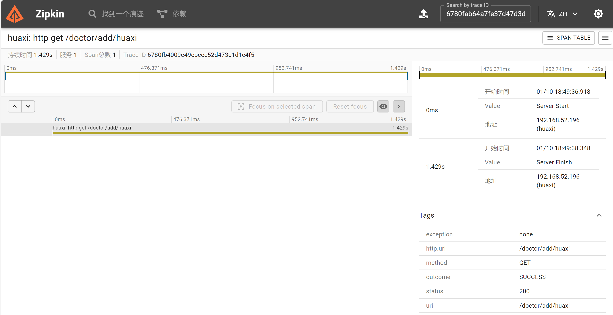

## 链路追踪

**`1.什么是链路追踪`**

1. 随着微服务架构的普及，应用程序由多个独立服务组成，各服务之间通过网络进行通信。这种架构增加了系统的复杂性，传统的日志和监控手段已不足以提供足够的可视化和分析能力。因此，链路追踪应运而生，成为现代分布式系统监控的重要组成部分。
2. 链路追踪的核心思想是记录请求在分布式系统中的完整路径，并收集相关度量数据。这些数据包括请求的来源、经过的节点、响应时间等，有助于分析请求的完整执行过程

**`2.基本概念`**

1. 标识请求：为每个请求分配一个唯一的标识符（如traceId），以便在系统中的各个节点进行关联。
2. 记录日志：在每个节点上记录请求的标识符、处理时间等信息，并将这些信息发送到追踪系统。
3. 传递上下文：在请求传递过程中，确保追踪上下文（如traceId、spanId等）能够被正确地传递给下一个节点。这通常通过在HTTP头信息中添加这些标识符来实现。
4. 聚合数据：将各个节点发送的日志数据进行聚合，形成完整的请求链路。
5. 可视化展示：将聚合后的数据以图形化的方式展示出来，方便分析人员查看和诊断问题。

## spring boot3整合micrometer

**`pom`**

``` xml
spring boot版本3.4.1
micrometer版本 1.4.1
管理依赖：
<dependencyManagement>
    <dependencies>
        <dependency>
            <groupId>io.micrometer</groupId>
            <artifactId>micrometer-tracing-bom</artifactId>
            <version>1.4.1</version>
            <type>pom</type>
            <scope>import</scope>
        </dependency>
    </dependencies>
</dependencyManagement>

<!--micrometer追踪门面-->
<dependency>
    <groupId>io.micrometer</groupId>
    <artifactId>micrometer-tracing</artifactId>
</dependency>
<dependency>
    <groupId>io.micrometer</groupId>
    <artifactId>micrometer-tracing-bridge-brave</artifactId>
</dependency>
<!--zipkin实现-->
<dependency>
    <groupId>io.zipkin.reporter2</groupId>
    <artifactId>zipkin-reporter-brave</artifactId>
</dependency>
<dependency>
    <groupId>io.zipkin.reporter2</groupId>
    <artifactId>zipkin-sender-urlconnection</artifactId>
</dependency>
<!--如有用openfeign则需要引入-->
<dependency>
    <groupId>io.github.openfeign</groupId>
    <artifactId>feign-micrometer</artifactId>
    <version>13.5</version>
</dependency>
<!--actuator必须引入-->
<dependency>
    <groupId>org.springframework.boot</groupId>
    <artifactId>spring-boot-starter-actuator</artifactId>
</dependency>

**`YAML配置`**

management:
  zipkin:
    tracing:
      endpoint: http://localhost:9411/api/v2/spans
  tracing:
    sampling:
      #采样率的概率，100%采样
      probability: 1.0
```

**`zipkin server端部署`**

```
docker run -d -p 9411:9411 openzipkin/zipkin
```

**`效果`**
