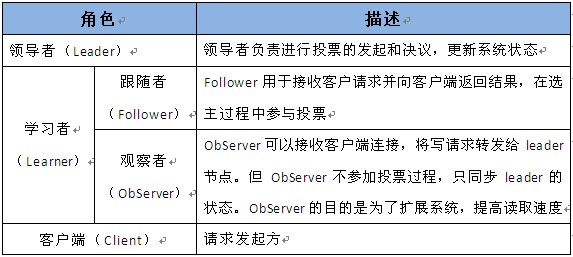
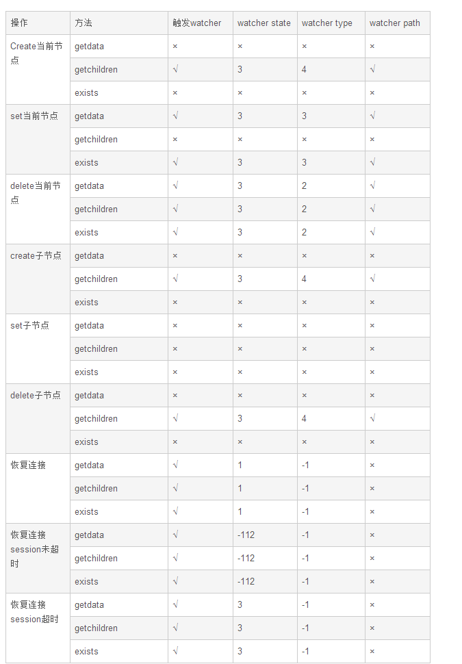

## Zookeeper简介

	ZooKeeper是一个分布式的，开放源码的分布式应用程序协调服务，它包含一个简单的原语集，分布式应用程序可以基于它实现同步服务，配置维护和命名服务等。Zookeeper是hadoop的一个子项目，其发展历程无需赘述。在分布式应用中，由于工程师不能很好地使用锁机制，以及基于消息的协调机制不适合在某些应用中使用，因此需要有一种可靠的、可扩展的、分布式的、可配置的协调机制来统一系统的状态。

----------

## Zookeeper的基本概念

**`1.角色`**
Zookeeper中的角色主要有以下三类，如下表所示：

**`2.特色`**

1. 最终一致性：client不论连接到哪个Server，展示给它都是同一个视图，这是zookeeper最重要的性能。
2. 可靠性：具有简单、健壮、良好的性能，如果消息m被到一台服务器接受，那么它将被所有的服务器接受。
3.

实时性：Zookeeper保证客户端将在一个时间间隔范围内获得服务器的更新信息，或者服务器失效的信息。但由于网络延时等原因，Zookeeper不能保证两个客户端能同时得到刚更新的数据，如果需要最新数据，应该在读数据之前调用sync()
接口。

4. 等待无关（wait-free）：慢的或者失效的client不得干预快速的client的请求，使得每个client都能有效的等待。
5. 原子性：更新只能成功或者失败，没有中间状态。
6. 顺序性：包括全局有序和偏序两种：全局有序是指如果在一台服务器上消息a在消息b前发布，则在所有Server上消息a都将在消息b前被发布；偏序是指如果一个消息b在消息a后被同一个发送者发布，a必将排在b前面。

**`3.工作原理`**

Zookeeper的核心是原子广播，这个机制保证了各个Server之间的同步。实现这个机制的协议叫做Zab协议。Zab协议有两种模式，它们分别是恢复模式（选主）和广播模式（同步）。当服务启动或者在领导者崩溃后，Zab就进入了恢复模式，当领导者被选举出来，且大多数Server完成了和leader的状态同步以后，恢复模式就结束了。状态同步保证了leader和Server具有相同的系统状态。为了保证事务的顺序一致性，zookeeper采用了递增的事务id号（zxid）来标识事务。所有的提议（proposal）都在被提出的时候加上了zxid。实现中zxid是一个64位的数字，它高32位是epoch用来标识leader关系是否改变，每次一个leader被选出来，它都会有一个新的epoch，标识当前属于那个leader的统治时期。低32位用于递增计数。

**`3.数据模型`**

1. 层次化的目录结构，命名符合常规文件系统规范
2. 每个节点在zookeeper中叫做znode,并且其有一个唯一的路径标识
3. 节点Znode可以包含数据和子节点，但是EPHEMERAL类型的节点不能有子节点
4. Znode中的数据可以有多个版本，比如某一个路径下存有多个数据版本，那么查询这个路径下的数据就需要带上版本
5. Znode有两种类型，短暂的（ephemeral）和持久的（persistent）
6. Znode的类型在创建时确定并且之后不能再修改
7. 短暂znode的客户端会话结束时，zookeeper会将该短暂znode删除，短暂znode不可以有子节点
8. 持久znode不依赖于客户端会话，只有当客户端明确要删除该持久znode时才会被删除
9. Znode有四种形式的目录节点，PERSISTENT、PERSISTENT_SEQUENTIAL、EPHEMERAL、EPHEMERAL_SEQUENTIAL
10. 数据只能存字节数组

    每个znode由3部分组成:
    1. stat. 此为状态信息, 描述该znode的版本, 权限等信息.
    2. data. 与该znode关联的数据.
    3. secondNode. 该znode下的子节点.

## Zookeeper原生api列子

	public static void main(String[] args) throws Exception{
		/** zookeeper地址 */
		final String CONNECT_ADDR = "192.168.80.88:2181,192.168.80.87:2181,192.168.80.86:2181";
		/** session超时时间 */
		final int SESSION_OUTTIME = 2000;//ms 
		/** 信号量，阻塞程序执行，用于等待zookeeper连接成功，发送成功信号 */
		final CountDownLatch connectedSemaphore = new CountDownLatch(1);
		ZooKeeper zk = new ZooKeeper(CONNECT_ADDR, SESSION_OUTTIME, new Watcher(){
			@Override
			public void process(WatchedEvent event) {
				//获取事件的状态
				KeeperState keeperState = event.getState();
				EventType eventType = event.getType();
				//如果是建立连接
				if(KeeperState.SyncConnected == keeperState){
					if(EventType.None == eventType){
						//如果建立连接成功，则发送信号量，让后续阻塞程序向下执行
						connectedSemaphore.countDown();
						System.out.println("zk 建立连接");
					}
				}
			}
		});
		//进行阻塞
		connectedSemaphore.await();
		
		//创建父节点
		zk.create("/firstNode", "firstNode".getBytes(), Ids.OPEN_ACL_UNSAFE, CreateMode.PERSISTENT);
		
		//创建子节点
		zk.create("/firstNode/secondNode", "secondNode data".getBytes(), Ids.OPEN_ACL_UNSAFE, CreateMode.PERSISTENT);
		
		//获取节点洗信息
		byte[] data = zk.getData("/firstNode", true, null);
		System.out.println(new String(data));
		System.out.println(zk.getsecondNode("/firstNode", true));
		
		//修改节点的值
		zk.setData("/firstNode", "modify data root".getBytes(), -1);
		byte[] data2 = zk.getData("/firstNode", true, null);
		System.out.println(new String(data2));		
		
		//判断节点是否存在
		System.out.println(zk.exists("/firstNode/secondNode", true));
		//删除节点
		zk.delete("/firstNode/secondNode", -1);
		System.out.println(zk.exists("/firstNode/secondNode", true));
		
		zk.close();
	}

	state=-112 会话超时状态
	state= -113　认证失败状态
	state=  1 连接建立中
	state= 2 (暂时不清楚如何理解这个状态,ZOO_ASSOCIATING_STATE)
	state=3 连接已建立状态
	state= 999 无连接状态
	
	
	type=1 创建节点事件
	type=2 删除节点事件
	type=3 更改节点事件
	type=4 子节点列表变化事件
	type= -1 会话session事件
	type=-2 监控被移除事件

对父节点的变更以及孙节点的变更都不会触发watcher，而对watcher本身节点以及子节点的变更会触发watcher，watcher是一次行需要重复注册，具体参照下表。

## zkclient列子

	public static void main(String[] args) throws Exception {
		final String CONNECT_ADDR = "127.0.0.1:2181";
		ZkClient zkc = new ZkClient(new ZkConnection(CONNECT_ADDR), 5000);

		// 对父节点添加监听子节点变化。
		zkc.subscribeChildChanges("/node", new IZkChildListener() {
			@Override
			public void handleChildChange(String parentPath, List<String> currentChilds) throws Exception {
				System.out.println("parentPath: " + parentPath);
				System.out.println("currentChilds: " + currentChilds);
			}
		});
		zkc.deleteRecursive("/node");
		Thread.sleep(3000);

		zkc.createPersistent("/node");
		Thread.sleep(1000);

		zkc.createPersistent("/node" + "/" + "node1", "node1内容");
		Thread.sleep(1000);

		zkc.createPersistent("/node" + "/" + "node2", "node2内容");
		Thread.sleep(1000);

		zkc.delete("/node/node2");
		Thread.sleep(1000);

		zkc.delete("/node/node2/node3");
		Thread.sleep(1000);

		zkc.deleteRecursive("/node");

	}

相比原生Api

1. zkclient是在官方API上进行封装使用更简洁。
2. zkclient可以递归的创建节点、递归的删除节点 没办法创建数据
3. watcher 的改进避免重复注册监听

    1. subscribeChildChanges只监听本节点或直接子节点创建、删除。
    2. subscribeDataChanges 只监听本节点或直接子节点创建、删除、数据的改变。

## curator列子

	public static void main(String[] args) throws Exception {
		final String CONNECT_ADDR = "127.0.0.1:2181";
		final int SESSION_OUTTIME = 5000;
		//1 重试策略：初试时间为1s 重试10次
		RetryPolicy retryPolicy = new ExponentialBackoffRetry(1000, 10);
		//2 通过工厂创建连接
		CuratorFramework cf = CuratorFrameworkFactory.builder()
					.connectString(CONNECT_ADDR)
					.sessionTimeoutMs(SESSION_OUTTIME)
					.retryPolicy(retryPolicy)
					.build();
		
		//3 建立连接
		cf.start();
		//4 建立一个cache缓存
		final NodeCache cache = new NodeCache(cf, "/firstNode", false);
		cache.start(true);
		//触发事件为创建节点和更新节点，在删除节点的时候并不触发此操作。
		cache.getListenable().addListener(new NodeCacheListener() { 
			@Override
			public void nodeChanged() throws Exception {
				System.out.println("路径为：" + cache.getCurrentData().getPath());
				System.out.println("数据为：" + new String(cache.getCurrentData().getData()));
				System.out.println("状态为：" + cache.getCurrentData().getStat());
			}
		});
		
		Thread.sleep(1000);
		cf.create().forPath("/firstNode", "123".getBytes());
		
		Thread.sleep(1000);
		cf.setData().forPath("/firstNode", "456".getBytes());
		
		Thread.sleep(1000);
		cf.delete().forPath("/firstNode");
		
		Thread.sleep(Integer.MAX_VALUE);
		cache.close();
		cf.close();
	}

	public static void main(String[] args) throws Exception {
		 final String CONNECT_ADDR = "127.0.0.1:2181";
		 final int SESSION_OUTTIME = 5000;
		//1 重试策略：初试时间为1s 重试10次
		RetryPolicy retryPolicy = new ExponentialBackoffRetry(1000, 10);
		//2 通过工厂创建连接
		CuratorFramework cf = CuratorFrameworkFactory.builder()
					.connectString(CONNECT_ADDR)
					.sessionTimeoutMs(SESSION_OUTTIME)
					.retryPolicy(retryPolicy)
					.build();
		//3 建立连接
		cf.start();
		//4 建立一个PathsecondNodeCache缓存,第三个参数为是否接受节点数据内容 如果为false则不接受
		PathsecondNodeCache cache = new PathsecondNodeCache(cf, "/firstNode", true);
		//5 在初始化的时候就进行缓存监听
		cache.start(StartMode.POST_INITIALIZED_EVENT);
		//监听子节点 新建、修改、删除
		cache.getListenable().addListener(new PathsecondNodeCacheListener() {
			@Override
			public void childEvent(CuratorFramework cf, PathsecondNodeCacheEvent event) throws Exception {
				switch (event.getType()) {
				case CHILD_ADDED:
					System.out.println("CHILD_ADDED :" + event.getData().getPath());
					break;
				case CHILD_UPDATED:
					System.out.println("CHILD_UPDATED :" + event.getData().getPath());
					break;
				case CHILD_REMOVED:
					System.out.println("CHILD_REMOVED :" + event.getData().getPath());
					break;
				default:
					break;
				}
			}
		});

		//创建本身节点不发生变化
		cf.create().forPath("/firstNode", "init".getBytes());
		
		//添加子节点
		Thread.sleep(1000);
		cf.create().forPath("/firstNode/secondNode", "secondNode内容".getBytes());
		Thread.sleep(1000);
		cf.create().forPath("/firstNode/thirdNode", "thirdNode内容".getBytes());
		
		//修改子节点
		Thread.sleep(1000);
		cf.setData().forPath("/firstNode/secondNode", "secondNode更新内容".getBytes());
		
		//删除子节点
		Thread.sleep(1000);
		cf.delete().forPath("/firstNode/thirdNode");		
		
		//删除本身节点
		Thread.sleep(1000);
		cf.delete().deletingsecondNodeIfNeeded().forPath("/firstNode");
		
		Thread.sleep(Integer.MAX_VALUE);
		cache.close();
		cf.close();
	}

## curator在分布式方面的应用

1. 分布式锁 InterProcessMutex

   		public static void main(String[] args) throws Exception {
   			//1 重试策略：初试时间为1s 重试10次
   			RetryPolicy retryPolicy = new ExponentialBackoffRetry(1000, 10);
   			//2 通过工厂创建连接
   			CuratorFramework cf = CuratorFrameworkFactory.builder()
   						.connectString("127.0.0.1:2181")
   						.sessionTimeoutMs(5000)
   						.retryPolicy(retryPolicy)
   						.build();
   			//3 开启连接
   			cf.start();
   			//4 分布式锁
   			final InterProcessMutex lock = new InterProcessMutex(cf, "/firstNode");
   			for(int i = 0; i < 10; i++){
   				new Thread(new Runnable() {
   					@Override
   					public void run() {
   						try {
   							//加锁
   							lock.acquire();
   							SimpleDateFormat sdf = new SimpleDateFormat("HH:mm:ss|SSS");
   							System.err.println(sdf);
   						} catch (Exception e) {
   							e.printStackTrace();
   						} finally {
   							try {
   								lock.release();
   							} catch (Exception e) {
   								e.printStackTrace();
   							}
   						}
   					}
   				},"t" + i).start();
   			}
   			Thread.sleep(100000);
   			cf.close();
   		}

`InterProcessMutex 与 Semaphore semaphore=new Semaphore(1);功能相似`

1. DistributedDoubleBarrier

   	public static void main(String[] args) throws Exception {
   		for(int i = 0; i < 5; i++){
   			new Thread(new Runnable() {
   				@Override
   				public void run() {
   					try {
   						RetryPolicy retryPolicy = new ExponentialBackoffRetry(1000, 10);
   						CuratorFramework cf = CuratorFrameworkFactory.builder()
   									.connectString("127.0.0.1:2181")
   									.retryPolicy(retryPolicy)
   									.build();
   						cf.start();
   						DistributedDoubleBarrier barrier = new DistributedDoubleBarrier(cf, "/firstNode", 5);
   						Thread.sleep(1000 * (new Random()).nextInt(3)); 
   						System.out.println(Thread.currentThread().getName() + "已经准备");
   						barrier.enter();
   						System.out.println("同时开始运行...");
   						Thread.sleep(1000 * (new Random()).nextInt(3));
   						System.out.println(Thread.currentThread().getName() + "运行完毕");
   						barrier.leave();
   						System.out.println("同时退出运行...");
   					} catch (Exception e) {
   						e.printStackTrace();
   					}
   				}
   			},"t" + i).start();
   		}
   	}

`DistributedDoubleBarrier 与 CyclicBarrier cyclicBarrier=new CyclicBarrier(n);功能相似`

1. DistributedBarrier

   	public static void main(String[] args) throws Exception {
   		for(int i = 0; i < 5; i++){
   			new Thread(new Runnable() {
   				@Override
   				public void run() {
   					try {
   						RetryPolicy retryPolicy = new ExponentialBackoffRetry(1000, 10);
   						CuratorFramework cf = CuratorFrameworkFactory.builder()
   									.connectString("127.0.0.1:2181")
   									.sessionTimeoutMs(5000)
   									.retryPolicy(retryPolicy)
   									.build();
   						cf.start();
   						DistributedBarrier barrier = new DistributedBarrier(cf, "/firstNode");
   						System.out.println(Thread.currentThread().getName() + "设置barrier!");
   						barrier.setBarrier();		//设置
   						barrier.waitOnBarrier();	//等待
   						System.out.println("---------开始执行程序----------");
   					} catch (Exception e) {
   						e.printStackTrace();
   					}
   				}
   			},"t" + i).start();
   		}

   		Thread.sleep(5000);
   		
   		RetryPolicy retryPolicy = new ExponentialBackoffRetry(1000, 10);
   		CuratorFramework cf = CuratorFrameworkFactory.builder()
   					.connectString(CONNECT_ADDR)
   					.sessionTimeoutMs(SESSION_OUTTIME)
   					.retryPolicy(retryPolicy)
   					.build();
   		cf.start();
   		DistributedBarrier barrier = new DistributedBarrier(cf, "/firstNode");
   		barrier.removeBarrier();	//释放
   	}

`DistributedBarrier 与 CountDownLatch countDownLatch=new CountDownLatch(1);功能相似`

1. DistributedAtomicInteger 分布式原子性

   	public static void main(String[] args) throws Exception {
   		//1 重试策略：初试时间为1s 重试10次
   		RetryPolicy retryPolicy = new ExponentialBackoffRetry(1000, 10);
   		//2 通过工厂创建连接
   		CuratorFramework cf = CuratorFrameworkFactory.builder()
   					.connectString("127.0.0.1:2181")
   					.sessionTimeoutMs(5000)
   					.retryPolicy(retryPolicy)
   					.build();
   		//3 开启连接
   		cf.start();
   		cf.delete().forPath("/firstNode");
   		

   		//4 使用DistributedAtomicInteger
   		DistributedAtomicInteger atomicIntger = 
   				new DistributedAtomicInteger(cf, "/firstNode", new RetryNTimes(3, 1000));
   		
   		AtomicValue<Integer> value = atomicIntger.add(1);
   		System.out.println(value.succeeded());
   		System.out.println(value.postValue());	//最新值
   		System.out.println(value.preValue());	//原始值
   		
   	}

1. 可以实现类“发布、订阅”功能

   PathsecondNodeCache cache = new PathsecondNodeCache(cf, "topic", true);
   cache.start(StartMode.POST_INITIALIZED_EVENT);
   cache.getListenable().addListener(new PathsecondNodeCacheListener() ｛｝
   //离线在上线，也可以收到 期间的事件。

**`curator 也是基于官方API封装，其语法支持链式编程，API更贴合开发人员思维，特别在分布式并发方面相当给力，建议使用curator。`**

## maven坐标

		<dependency>
		    <groupId>org.apache.zookeeper</groupId>
		    <artifactId>zookeeper</artifactId>
		    <version>3.5.3-beta</version>
		    <type>pom</type>
		</dependency>
		
		
		<dependency>
		    <groupId>com.101tec</groupId>
		    <artifactId>zkclient</artifactId>
		    <version>0.9</version>
		</dependency>

		<dependency>
		    <groupId>org.apache.curator</groupId>
		    <artifactId>curator-framework</artifactId>
		    <version>4.0.0</version>
		</dependency>
		<dependency>
		    <groupId>org.apache.curator</groupId>
		    <artifactId>curator-recipes</artifactId>
		    <version>4.0.0</version>
		</dependency>
		]()